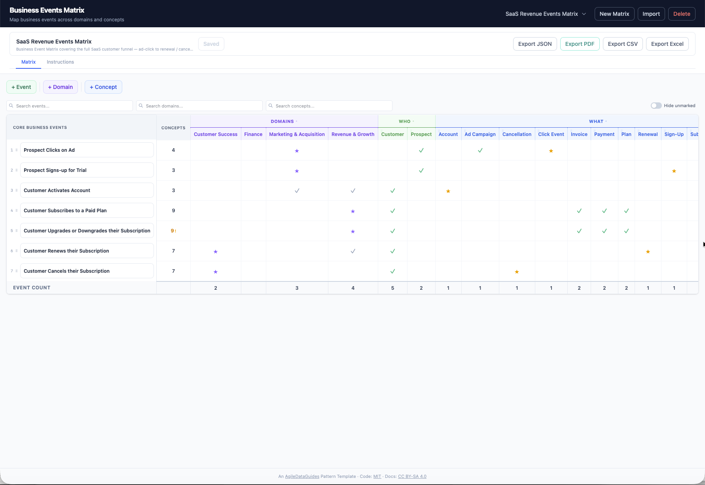

# Business Event Matrix

Model your Business Domains, Core Business Events, and the Core Business Concepts that describe them. The Business Event Matrix provides a visual grid showing which Concepts are involved in each Event and which Domain own them.

An [AgileDataGuides](https://agiledataguides.com/agiledata-templates/) Pattern Template app.

## What It Does

The Business Event Matrix maps the relationship between business events and the concepts they involve, as well as identifying which domain owns them:

| Section | Purpose |
|---------|---------|
| **Domains** | Business domains that group related concepts (e.g. Customer, Product, Finance) |
| **Events** | Core Business Events — things that happen in the business (e.g. Customer Places Order) |
| **Concepts** | Core Business Concepts within each domain (e.g. Customer, Product, Order) |
| **Marks** | Check (✓) to indicate a Concept is involved in an Event, or star (★) to indicate that the Event drives the creation of that Concept's values — e.g. starring Order on the Customer Places Order event means that event is what creates new order IDs |

## Try It Online

**[Launch the Live Demo](https://agiledataguides.github.io/business-event-matrix)** — no install required. The demo runs entirely in your browser. Your data is saved in localStorage and never leaves your device.

The demo includes three example matrix so you can explore the app straight away.

## Install and Run

Double-click `start-BEM.command` (macOS) or run `./start-BEM.sh` from the terminal.

The app starts at [http://localhost:5121](http://localhost:5121).

**Requires**: [Node.js](https://nodejs.org/) (v18+) and [pnpm](https://pnpm.io/) (`npm install -g pnpm`).

## Features

- **Matrix grid** — events as rows, concepts as columns, flagged by domain
- **Check/star marks** — click cells to mark concept involvement in events
- **Import JSON** — load a previously exported matrix
- **Multiple matrix models** — create, switch between, and delete an event matrix
- **Inline editing** — click any card to select; double-click to rename
- **Auto-save** — changes persist to browser localStorage
- **Export JSON** — download the matrix to share or re-import
- **Save to disk** — writes JSON to `data/` for direct access by Claude or other tools

## Works With Claude

Export your matrix as JSON and use it with [Claude Code](https://claude.ai/claude-code) or [Claude Chat](https://claude.ai):

- *"Which concepts are involved in the most events?"*
- *"Are there any events that don't involve any concepts?"*
- *"Suggest missing business events for the Customer domain"*
- *"Draft an Information Product Canvas based on this matrix"*
- *"Which domains have the most overlap?"*

## Data Storage

**Save** writes canvas files to the `data/` folder as JSON. This only works in dev mode (`pnpm dev`) where the server can write to disk. Claude Code can then read these files directly.

**Export** downloads files to your browser's downloads folder for sharing or backup.

**Auto-save** persists the current state to browser localStorage automatically.

## Security

This app is designed to run locally on your own machine. Do not expose it to the internet or deploy it on a public server. The Save feature writes files directly to your filesystem. There is no user authentication, so anyone who can reach the server can read and overwrite your data.

If you need to share your work, use the **Export** buttons to download files and share them manually.

## Tech Stack

- [SvelteKit 5](https://svelte.dev/) with Svelte 5 runes
- [Tailwind CSS 4](https://tailwindcss.com/)
- TypeScript
- pnpm

## Licensing

- **Code**: [MIT](./LICENSE)
- **Documentation**: [CC BY-SA 4.0](./docs/LICENSE)
